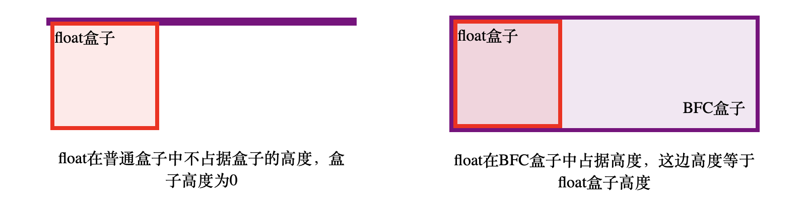
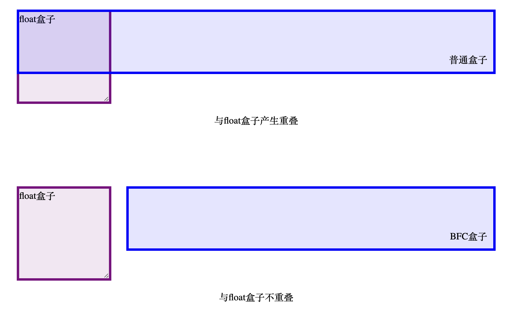
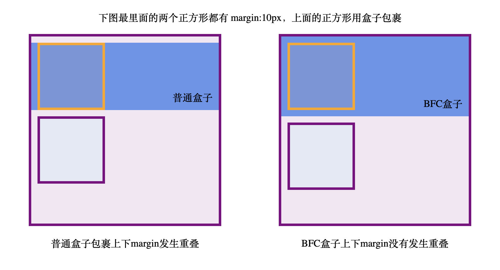

BFC，全称为“Block Formatting Context”（块级格式化上下文），是CSS布局中的一个概念。BFC是一个独立的渲染区域，拥有自己的渲染规则，**内部元素的布局不会影响外部元素，也不会受到外部元素的影响**。

## BFC触发条件
1. 文档的根元素（`<html>`）。
2. 浮动元素（即 [`float`](https://developer.mozilla.org/zh-CN/docs/Web/CSS/float) 值不为 `none` 的元素）。
3. 绝对定位元素（[`position`](https://developer.mozilla.org/zh-CN/docs/Web/CSS/position) 值为 `absolute` 或 `fixed` 的元素）。
4. 行内块元素（[`display`](https://developer.mozilla.org/zh-CN/docs/Web/CSS/display) 值为 `inline-block` 的元素）。
5. 表格单元格（[`display`](https://developer.mozilla.org/zh-CN/docs/Web/CSS/display) 值为 `table-cell`，HTML 表格单元格默认值）。
6. 表格标题（[`display`](https://developer.mozilla.org/zh-CN/docs/Web/CSS/display) 值为 `table-caption`，HTML 表格标题默认值）。
7. 匿名表格单元格元素（[`display`](https://developer.mozilla.org/zh-CN/docs/Web/CSS/display) 值为 `table`（HTML 表格默认值）、`table-row`（表格行默认值）、`table-row-group`（表格体默认值）、`table-header-group`（表格头部默认值）、`table-footer-group`（表格尾部默认值）或 `inline-table`）。
8. [`overflow`](https://developer.mozilla.org/zh-CN/docs/Web/CSS/overflow) 值不为 `visible` 或 `clip` 的块级元素。
9. [`display`](https://developer.mozilla.org/zh-CN/docs/Web/CSS/display) 值为 `flow-root` 的元素。
10. [`contain`](https://developer.mozilla.org/zh-CN/docs/Web/CSS/contain) 值为 `layout`、`content` 或 `paint` 的元素。
11. 弹性元素（[`display`](https://developer.mozilla.org/zh-CN/docs/Web/CSS/display) 值为 `flex` 或 `inline-flex` 元素的直接子元素），如果它们本身既不是[弹性](https://developer.mozilla.org/zh-CN/docs/Glossary/Flex_Container)、[网格](https://developer.mozilla.org/zh-CN/docs/Glossary/Grid_Container)也不是[表格](https://developer.mozilla.org/zh-CN/docs/Web/CSS/CSS_table)容器。
12. 网格元素（[`display`](https://developer.mozilla.org/zh-CN/docs/Web/CSS/display) 值为 `grid` 或 `inline-grid` 元素的直接子元素），如果它们本身既不是[弹性](https://developer.mozilla.org/zh-CN/docs/Glossary/Flex_Container)、[网格](https://developer.mozilla.org/zh-CN/docs/Glossary/Grid_Container)也不是[表格](https://developer.mozilla.org/zh-CN/docs/Web/CSS/CSS_table)容器。
13. 多列容器（[`column-count`](https://developer.mozilla.org/zh-CN/docs/Web/CSS/column-count) 或 [`column-width`](https://developer.mozilla.org/en-US/docs/Web/CSS/column-width "此页面目前仅提供英文版本") 值不为 `auto`，且含有 `column-count: 1` 的元素）。
14. `column-span` 值为 `all` 的元素始终会创建一个新的格式化上下文，即使该元素没有包裹在一个多列容器中（[规范变更](https://github.com/w3c/csswg-drafts/commit/a8634b96900279916bd6c505fda88dda71d8ec51)、[Chrome bug](https://bugs.chromium.org/p/chromium/issues/detail?id=709362)）

## BFC特性


### 1. **包含内部浮动**：计算BFC的高度时，浮动子元素也会被计算在内


### 2. **排除外部浮动**：BFC不盒子不会与兄弟浮动盒子重叠


### 3. **阻止外边距重叠**：上下margin不会重叠


### 4. BFC内部的块级盒子会在垂直方向，从上往下一个接一个地放置

### 5. 内部元素的布局不会影响外部元素，也不会受到外部元素的影响

## BFC的应用场景
### 清除浮动（利用特性：包含内部浮动）
当一个元素的子元素浮动时，父元素可能会高度塌陷。可以通过触发BFC来解决这个问题。
```css
.clearfix {
  overflow: hidden; /* 触发BFC */
}
```

### 防止外边距重叠（利用特性：阻止外边距重叠）
相邻元素的垂直外边距会发生折叠。通过触发BFC，可以防止这种情况。
```css
.element {
  overflow: hidden; /* 触发BFC */
}

```
### 自适应多列布局（利用特性：排除外部浮动）
在浮动布局中，BFC可以用来创建自适应的多列布局。
```css
.column {
  float: left;
  width: 50%; /* 假设两列布局 */
}
.container {
  overflow: hidden; /* 触发BFC */
}

```
### 避免浮动元素影响（利用特性：BFC内外部不互相影响）
当你不希望一个容器内的元素受外部浮动元素影响时，可以使用BFC。
```css
.bfc-container {
  overflow: auto; /* 触发BFC */
}

```


---
## 参考
https://developer.mozilla.org/zh-CN/docs/Web/CSS/CSS_display/Block_formatting_context
https://chatgpt.com/