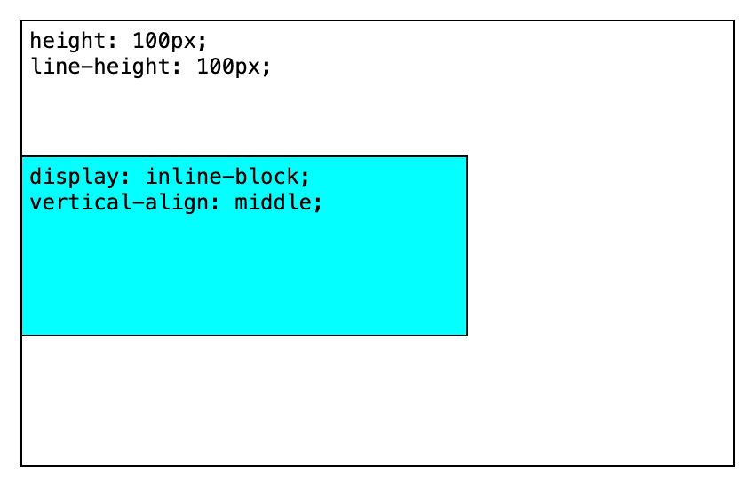
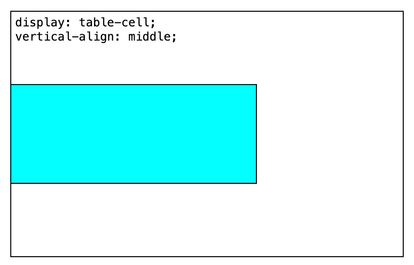
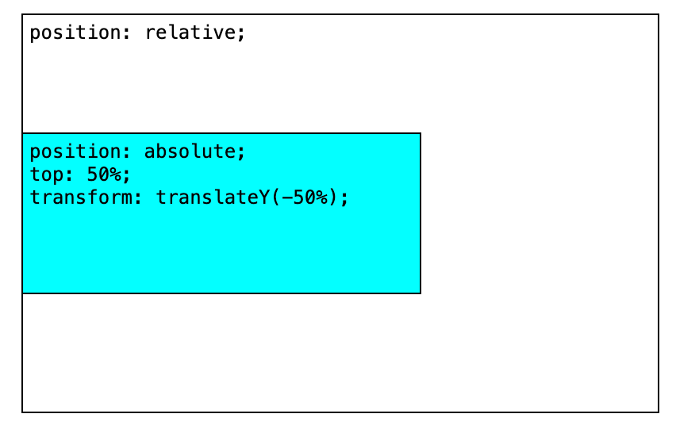
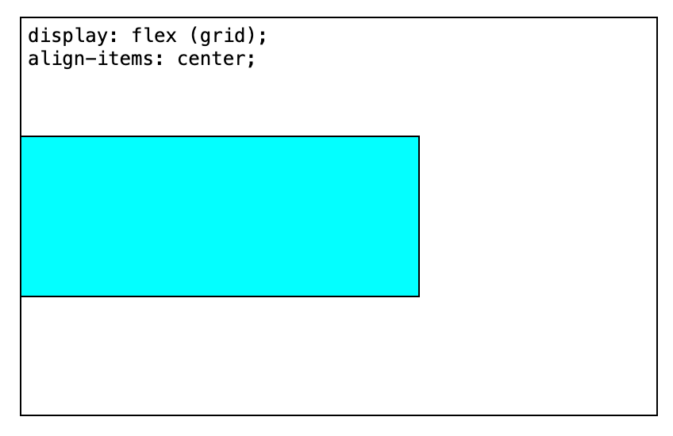
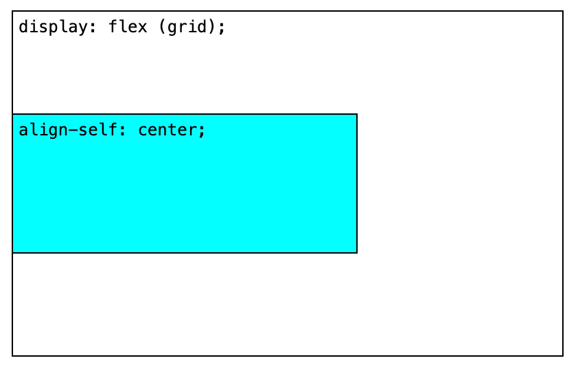
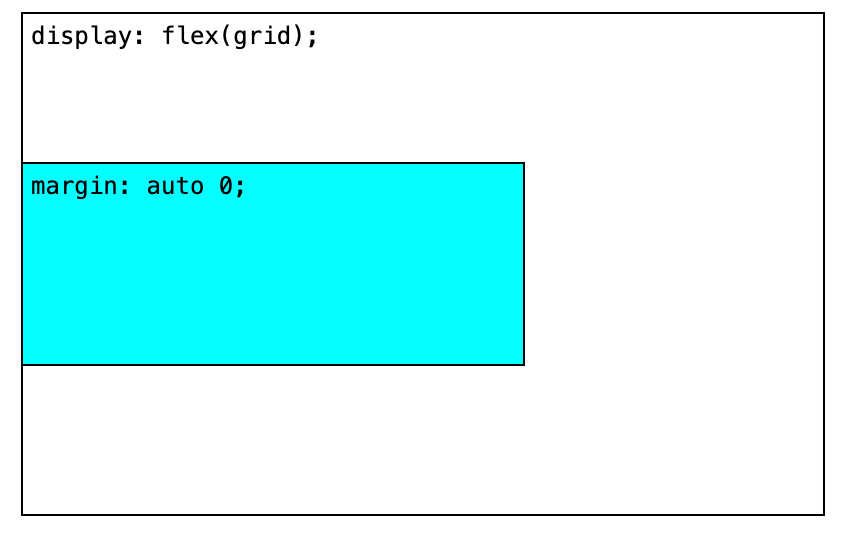
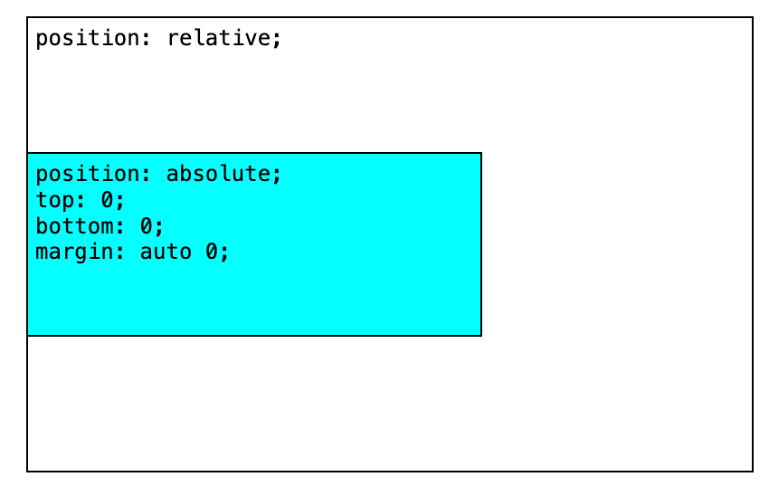

# CSS 垂直居中

[Demo.html](/code/css/vertical-center/index.html)

## vertical-align: middle

### line-height = height

### table-cell

## absolute / transform

## flex (grid)

### align-items

### align-self

## margin: auto 0

### flex (grid)

### absolute

