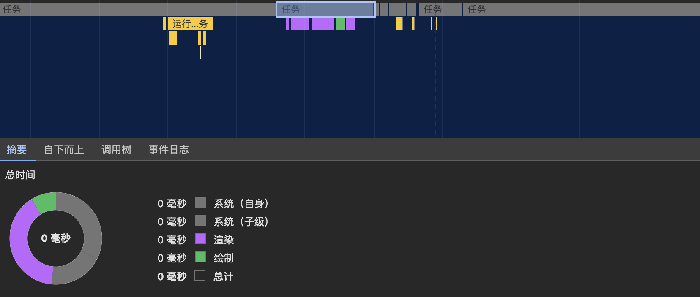
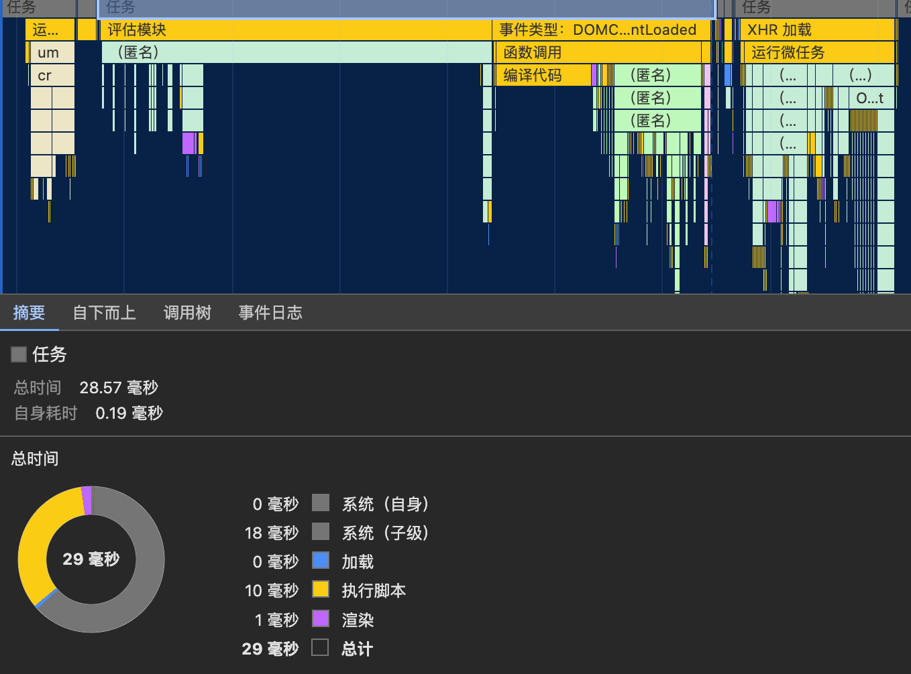

# 事件循环

JavaScript 是一种单线程语言，这意味着它一次只能执行一个任务。然而，JavaScript 能够处理异步操作，比如网络请求、定时事件等，而不会导致程序挂起。这得益于 JavaScript 的事件循环机制。

事件循环（Event Loop）是 JavaScript 运行时的一个核心概念，它允许 JavaScript 引擎在单线程环境中执行异步操作。

事件循环的机制使得 JavaScript 能够以**非阻塞的方式处理大量任务**，包括**同步和异步任务**。这种机制是 JavaScript 能够实现**高性能和高响应性**的关键因素之一。

## 基本概念

### 执行栈（Call Stack）

这是 JavaScript 执行代码的地方。当 JavaScript 执行代码时，所有同步任务都会添加到这个栈中。

### 事件队列（Event Queue）

当异步任务完成时，它们会被放入一个或多个事件队列中。每个队列可能代表不同类型的事件，比如网络请求、定时器、用户交互等。

**事件队列分为宏任务队列（Macro Task Queue）和微任务队列（Micro Task Queue）**
**微任务优先级比宏任务高，微任务先执行**

#### 宏任务队列（Macro Task Queue）

宏任务队列包含了一些**需要较长时间执行**的任务，它们通常不会立即执行，而是在当前执行栈清空后按顺序执行。
常见的**宏任务**包括：

-   `setTimeout`、` setInterval`、`setImmediate`
-   I/O 操作
    -   网络请求：如 XMLHttpRequest 发起的 HTTP 请求（promise、fetch 发起请求也算是宏任务，回调是微任务）
    -   文件读取/写入：通过 FileReader API，可以读取本地文件系统中的文件内容
    -   与服务器的通信：包括数据的上传和下载等。
-   DOM 事件的回调
    -   如 load、error、resize、scroll、click 等，这些事件的回调函数
-   `requestAnimationFrame`  用于动画和页面渲染（其回调函数会在浏览器下一次重绘前执行）

##### UI 渲染

这边的一个任务的小灰快就是一次事件循环，也就是一个宏任务。



这个图片可以看到 UI 渲染单独在一个宏任务中执行



上图的 UI 渲染穿插在一个宏任务中

> -   UI 渲染在事件循环中通常会作为一个宏任务执行，也可能在某个宏任务中穿插执行。因此通常情况下算宏任务，但是也存在不算宏任务的情况。
> -   此外绿色绘制部分会开启宏任务，紫色渲染部分只要在一个宏任务中进行就可以（目前观察结果是这样）
> -   绘制可能是回流，渲染可能是重绘（🤔 可能是，但是绘制和渲染可能不止包含回流和重绘）

#### 微任务队列（Micro Task Queue）

微任务队列包含了一些**需要尽快执行**的任务，它们会在当前执行栈清空以及当前宏任务完成后立即执行。
常见的**微任务**包括：

-   Promise 回调的回调函数（then、catch、finally）(new Promise 这个过程是同步的，只要到回调函数的时候是微任务)
-   `MutationObserver`  回调，用于监听 DOM 变动
-   Node.js 的 `process.nextTick(fn)`：引擎在当前操作结束（下个事件循环开始之前），调用该回调函数。
-   `queueMicrotask()` API： 是一个 Web API，它允许你在当前 JavaScript 执行栈的尾部（也就是当前宏任务的尾部）立即调度一个微任务的执行。这意味着注册的微任务会在当前执行栈清空之后、事件循环的下一个宏任务开始之前执行。
-   Vue 中的`nextTick()`
    -   Vue2：根据浏览器是否支持，按照优先级实现：`MutationObserver`>`Promise`>`setImmediate`>`setTimeout(fn,0)`
    -   Vue3：根据浏览器是否支持，按照优先级实现：`queueMicroTask`>`Promise.resolve().then(callback)`

> queueMicrotask() 与 Promise.then() 的区别在于执行时机。Promise.then() 中的回调是一个微任务，但它会等待当前执行栈中的所有同步和微任务完成后才执行。而 queueMicrotask() 则用于在当前执行栈清空后立即执行，即使有其他 Promise.then() 微任务在队列中等待。
>
> Promise.then()执行时机稍晚一些
>
> 在 Node.js 中，nextTick 会将回调函数放入一个微任务队列中。当当前执行栈完成后，会先执行微任务队列中的任务，然后再进入下一次事件循环。这样可以确保在当前阶段的操作完成后，尽快执行 nextTick 中的回调，而不需要等待下一次宏任务（如定时器、I/O 操作等）的触发。

## 事件循环过程

一个事件循环可以看成一个宏任务的执行过程。整体可以看成按照顺序执行执行宏任务

同一层级下优先级：同步任务>微任务>宏任务

-   首先执行整体代码（整体看成一个宏任务）
-   碰到同步任务直接执行，碰到微任务、宏任务将其加入对应的微任务、宏任务队列
-   同步任务执行完后开始执行微任务，执行微任务过程中产生的微任务、宏任务也是分别加入各自的队列
-   等到所有微任务执行完成，包括微任务中产生的微任务（微任务队列为空，执行栈也为空）的时候，执行宏任务队列中的下一个宏任务
-   然后循环往复这个构成，一个一个宏任务执行下去

```js
console.log('Start')

setTimeout(() => {
    console.log('第一层的宏任务')
    // 假设在这个宏任务中，又触发了一个微任务
    Promise.resolve().then(() => {
        console.log('第二层的微任务')
        // 微任务中又触发了宏任务
        // 第一层的宏任务2比这个先加入，所以第三层的宏任务最后执行
        setTimeout(() => {
            console.log('第三层的宏任务')
        })
        Promise.resolve().then(() => {
            console.log('第三层的微任务')
        })
    })
}, 0)

setTimeout(() => {
    console.log('第一层的宏任务2')
})

// 这个微任务会在第一个宏任务执行完毕后执行
Promise.resolve().then(() => {
    console.log('第一层的微任务')
})

console.log('End')

// 打印结果
// Start
// End
// 第一层的微任务
// 第一层的宏任务
// 第二层的微任务
// 第三层的微任务
// 第一层的宏任务2
// 第三层的宏任务
```

## 为什么微任务优先级高于宏任务

宏任务如 setTimeout、I/O、UI 渲染 等通常都需要更长的时间来完成，如果宏任务优先执行会造成阻塞。
